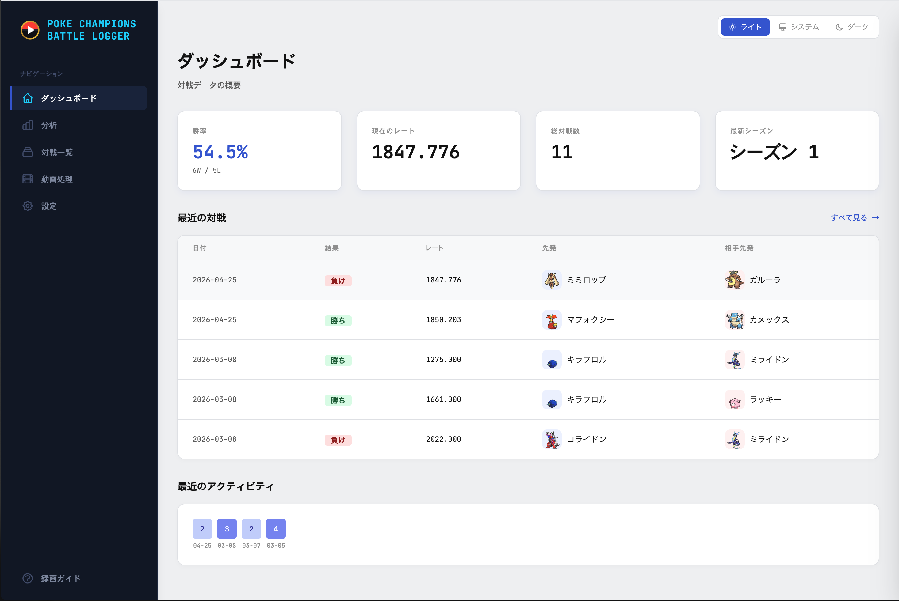
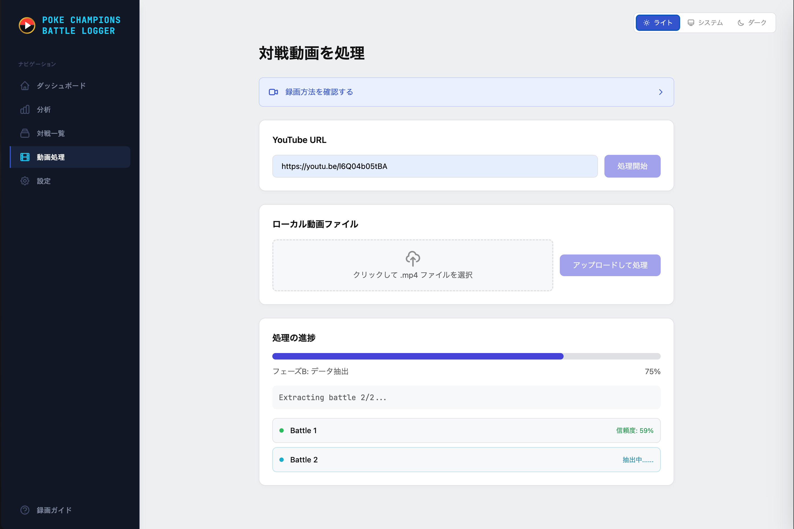
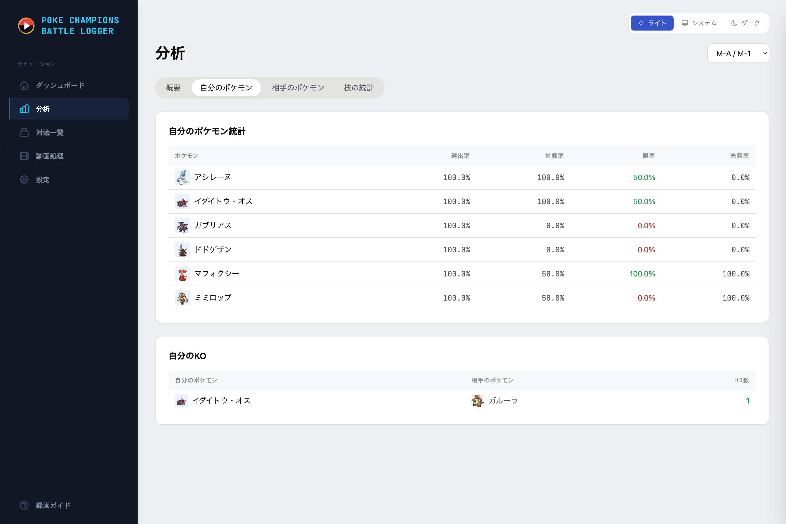
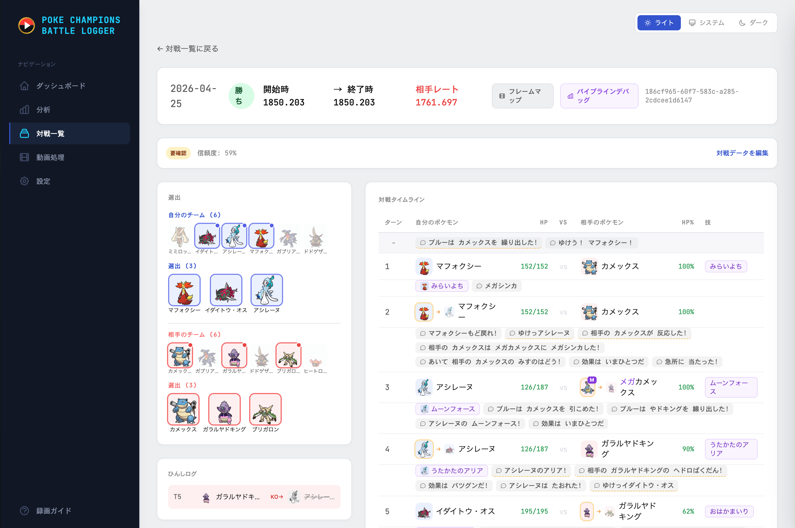

# Pokemon Champions Battle Logger

  
  
  
  

  <strong>Dominate Your Battle Data.</strong> 
  Pokemon Champions Battle Logger automatically records and analyzes your battles from video.

> 🇯🇵 日本語版は [README.md](README.md) をご覧ください。

---

## Features

- **Auto Battle Detection** - Drop a YouTube URL or local video file, and AI automatically detects battles, recognizes Pokemon, reads moves, and determines win/loss
- **Deep Analytics** - Win rate trends, team selection stats, knockout statistics, all visualized in real-time dashboards
- **8 Languages** - Japanese, English, Traditional Chinese, Simplified Chinese, Korean, French, Spanish, Italian, German
- **100% Local** - Your data stays on your machine. No cloud, no accounts, no tracking
- **Free for Personal Use**

## Download

> **Latest Release**: [Download here](https://github.com/fufufukakaka/pokemon_champions_battle_logger/releases/latest)

| Platform | File |
|----------|------|
| Windows (x64) | `poke-champions-logger-windows-x64-setup.exe` |
| macOS (Apple Silicon) | `poke-champions-logger-macos-arm64.dmg` |
| Linux (x64) | `poke-champions-logger-linux-x64.deb` |

### Quick Start

1. Download the installer for your platform from [Releases](https://github.com/fufufukakaka/pokemon_champions_battle_logger/releases/latest)
2. Install / open the app (see platform notes below)
3. The app opens in your browser at `http://127.0.0.1:8000`
4. Follow the initial setup wizard (choose language, enter trainer name)

### Windows Users

Windows SmartScreen may display a **"Windows protected your PC"** warning when launching the app for the first time. This is because the executable is not code-signed (Windows code-signing certificates are prohibitively expensive for an open-source project).

To run the app:

1. Click **More info** on the warning dialog
2. Click **Run anyway**

Some antivirus software may also flag the executable as a false positive. If this happens, please add an exception for `poke_champions_logger.exe`.

### macOS Users

The macOS build is code-signed with a Developer ID certificate, but **not notarized by Apple** (Apple's notary service has been intermittently failing to process this app's bundle structure — see [tauri-apps/tauri#11992](https://github.com/tauri-apps/tauri/issues/11992)). Gatekeeper will therefore display a warning the first time you launch the app.

> **⚠️ Important — macOS Sequoia / Tahoe users**
>
> The first-launch warning shows two buttons: **Move to Trash** (「ゴミ箱に入れる」) and **Done** (「完了」). **Do NOT click "Move to Trash"** — it will delete the app you just installed. Click **Done** and follow the steps below to allow the app via System Settings.

#### First-launch instructions (one-time only)

##### macOS Sequoia 15 / Tahoe 26 or later

1. Open the downloaded `.dmg` and drag **Pokemon Champions Battle Logger.app** into your **Applications** folder
2. Try to launch the app — the warning dialog appears. Click **Done** (「完了」). *Do not click "Move to Trash".*
3. Open **System Settings → Privacy & Security**
4. Scroll to the **Security** section — you'll see *"Pokemon Champions Battle Logger" was blocked to protect your Mac.*
5. Click **Open Anyway** (「このまま開く」), then confirm with your Touch ID or password
6. Try launching the app again — a dialog with an **Open** (「開く」) button appears. Click it.
7. The app launches; macOS remembers your decision and opens normally on subsequent launches

##### macOS Sonoma 14 or earlier

1. Open the downloaded `.dmg` and drag **Pokemon Champions Battle Logger.app** into your **Applications** folder
2. Open Finder, navigate to **Applications**
3. **Right-click** (or Control-click) the app, then choose **Open** from the context menu
4. A dialog appears: *"macOS cannot verify the developer of …"* — click **Open**
5. The app launches; macOS remembers your decision and opens normally on subsequent launches

The app's signature is fully verifiable with `codesign --verify` and traces back to the registered Apple Developer account `Yusuke Fukasawa (D8NPWYTRLD)`. Notarization will be re-enabled in a future release once the upstream issue is resolved.

## Screenshots

### Dashboard

  

### Video Processing

  

### Analysis

  

### Battle Detail

  

## Requirements

- **Video input**: 1920x1080 (1080p) 30fps video
- **Format**: Single battles in Pokemon Champions
- **Storage**: ~500MB for the app + model files downloaded on first launch

## Community

- [Report a Bug](https://github.com/fufufukakaka/pokemon_champions_battle_logger/issues/new?template=bug_report.yml)
- [Request a Feature](https://github.com/fufufukakaka/pokemon_champions_battle_logger/issues/new?template=feature_request.yml)
<!-- - [Discord](https://discord.gg/XXXXX) -->

## License

This software is released under a proprietary **All Rights Reserved** license.

You are permitted to download the Software from the official distribution channel (GitHub Releases) and use it for **personal, non-commercial purposes**. **Redistribution, modification, reverse engineering, and commercial use are prohibited.**

See [LICENSE](LICENSE) for full terms.

---

Made with love for Pokemon Trainers

