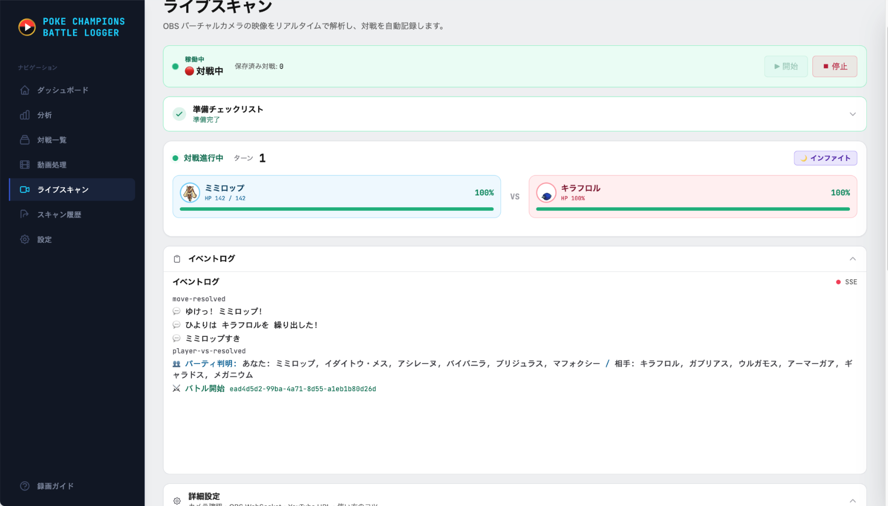

# Pokemon Champions Battle Logger

> 🌐 **English version**: see [README.en.md](README.en.md)

  
  
  
  

  <strong>Dominate Your Battle Data</strong> 
  ポケモンチャンピオンズの対戦を、ライブ中または録画から自動で記録・解析するツールです。

---

## 機能

- **Live Scan** — OBS Virtual Camera の映像を読み取り、対戦中にターン・HP・場のポケモンを記録します
- **録画解析** — YouTube URL またはローカル動画ファイルから、バトル検出・ポケモン認識・技解析・勝敗判定を行います。Android / iPhoneで直接録画した横長動画も、解像度と画面比率を自動判定して解析できます
- **シングル / ダブル対応** — どちらの形式でも対戦ログ、選出、相手構築、採用統計を扱えます
- **対戦中の補助表示** — 相手 6 体から上位構築候補や過去対戦を表示し、ダメージ計算デスクで立ち回りを確認できます
- **分析ダッシュボード** — 勝率推移、選出統計、KO 統計、対戦詳細、メモをまとめて振り返れます
- **言語対応** — アプリ UI は日本語 / 英語。ゲーム表示は日本語、英語、繁体中文、簡体中文、韓国語、フランス語、スペイン語、イタリア語、ドイツ語に対応しています
- **ローカル保存** — 対戦データはお手元のマシンに保存されます。一部の OCR / AI 機能は、設定した外部 AI API を利用する場合があります
- **個人利用は無料**

## ダウンロード

> **最新リリース**: [こちらからダウンロード](https://github.com/fufufukakaka/pokemon_champions_battle_logger/releases/latest)

| プラットフォーム | ファイル |
|----------|------|
| Windows (x64) | `poke-champions-logger-windows-x64-setup.exe` |
| macOS (Apple Silicon) | `poke-champions-logger-macos-arm64.dmg` |
| Linux (x64) | `poke-champions-logger-linux-x64.deb` |

### クイックスタート

1. ご利用のプラットフォームのインストーラを [Releases](https://github.com/fufufukakaka/pokemon_champions_battle_logger/releases/latest) からダウンロード
2. インストール / アプリを起動 (プラットフォーム別の注意事項は下記参照)
3. ブラウザで `http://127.0.0.1:8000` が自動的に開きます
4. 初期設定ウィザードに従って設定 (言語選択、トレーナー名入力)

### Windows ユーザの方へ

初回起動時に Windows SmartScreen が **「Windows によって PC が保護されました」** という警告を表示する場合があります。これは実行ファイルがコード署名されていないためです (Windows のコード署名証明書は個人開発プロジェクトにとって高額すぎるため見送っています)。

アプリを起動するには:

1. 警告ダイアログの **「詳細情報」** をクリック
2. **「実行」** をクリック

一部のアンチウイルスソフトが誤検出としてフラグを立てる場合もあります。その際は `poke_champions_logger.exe` を例外として追加してください。

## スクリーンショット

### ダッシュボード

  

### ライブスキャン

  

### 分析

  

### バトル詳細

  

## 動作環境

- **入力**: SwitchおよびAndroid / iPhoneの横長動画。解像度・画面比率は自動判定（高さ720px以上、30fps推奨）
- **形式**: ポケモンチャンピオンズのシングル / ダブルバトル
- **Live Scan**: OBS Virtual Camera または同等のカメラ入力
- **ストレージ**: アプリ本体と初回起動時にダウンロードされるモデルファイルで数百 MB 程度

## コミュニティ

- [バグ報告](https://github.com/fufufukakaka/pokemon_champions_battle_logger/issues/new?template=bug_report.yml)
- [機能リクエスト](https://github.com/fufufukakaka/pokemon_champions_battle_logger/issues/new?template=feature_request.yml)
- [Discord](https://discord.gg/37ApwRvUrW)
- [X (Twitter)](https://x.com/pokechampbatlog)

## 開発支援

個人開発のため、継続的な改善には時間と検証環境の維持が必要です。役に立ったら Buy Me a Coffee から支援できます。

  

## ライセンス

本ソフトウェアは **All Rights Reserved**（独自プロプライエタリライセンス）です。

公式配布チャネル（GitHub Releases）からダウンロードして**個人かつ非商用の目的**で使用することを許諾します。**再配布・改変・リバースエンジニアリング・商用利用は禁止**です。

詳細は [LICENSE](LICENSE) を参照してください。
